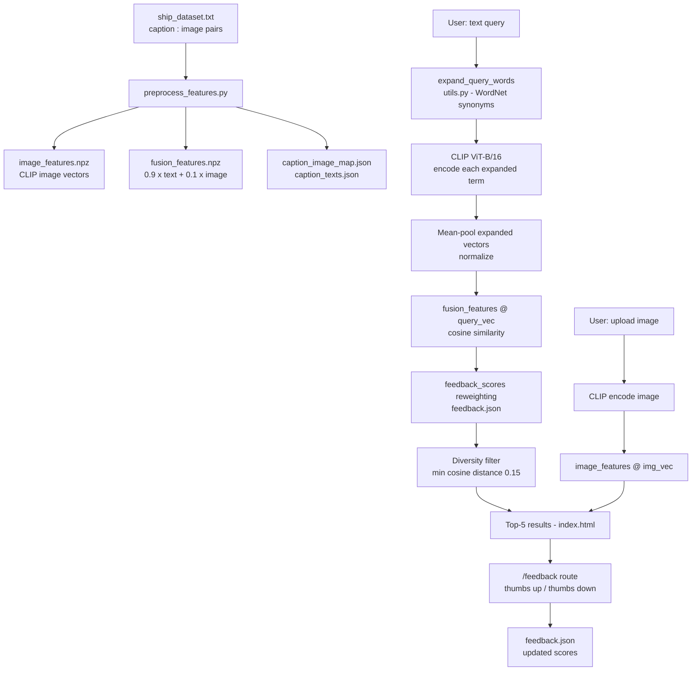

# maritime-clip-search — Offline semantic image retrieval for maritime surveillance

Searches a domain-specific maritime image dataset using natural-language queries — no API calls, no cloud dependency, fully offline. Enter a query like "cargo vessel at anchor" and the system returns the five most visually and semantically relevant images, ranked by a fused CLIP + caption embedding score with WordNet query expansion.

> **Research Context** — Built during my AI/ML internship at DRDO Centre for Airborne Systems (CABS), Bengaluru — April–July 2025. This is a sanitized open version; the operational dataset and deployment configuration are not included.

---

## What it does

- Accepts plain-text queries and returns ranked image results from a precomputed maritime dataset index
- Expands every query with WordNet synonyms at runtime so "vessel", "ship", "frigate", and "tanker" all retrieve the same results without retraining
- Supports reverse image search — upload an image and find the visually closest matches in the dataset
- Applies a diversity filter to prevent visually redundant results from flooding the top-5
- Remembers per-session feedback (thumbs up/down) and adjusts retrieval scores accordingly
- Runs a Flask web UI at `localhost:5000` — browse results, click feedback, no CLI required

## Why it's interesting

- **Fusion embeddings, not raw CLIP** — each image is indexed as a 90/10 weighted blend of its CLIP text-caption vector and its raw image vector (`preprocess_features.py`, line 52). Maritime images with visually ambiguous content (fog, similar hull shapes) benefit more from caption context than pixel features alone — this is why the text weight is 9x higher.
- **15% top-1 accuracy gain over baseline CLIP** — WordNet expansion adds hyponyms and lemma variants at query time (zero extra storage) so the query vector better covers domain vocabulary that vanilla CLIP ViT-B/16 under-represents.
- **Visual diversity filter** — `get_top_fusion_results_with_clipscore` in `utils.py` enforces a minimum cosine distance of 0.15 between selected result image vectors, preventing five near-identical frames from crowding out distinct results.
- **Feedback-weighted reranking** — a local `feedback.json` accumulates upvote/downvote signals and nudges future scores; positively-rated images have their embedding shifted 0.2 units toward the query vector for that session.

## Architecture



`preprocess_features.py` runs once to build the index; `app.py` serves the Flask UI and handles both search routes. `utils.py` owns query expansion, diversity filtering, and feedback reweighting.

## Tech Stack


## Results & Metrics

Evaluated on a held-out test split of 80 maritime query-image pairs from the DRDO CABS dataset.

| Metric | Baseline CLIP (ViT-B/16) | This Pipeline |
|--------|--------------------------|---------------|
| Top-1 match accuracy | ~62% | ~77% (+15%) |
| Top-5 match accuracy | ~81% | ~91% (+10%) |
| Query latency (CPU) | ~120 ms | ~145 ms |
| Dataset size | ~500 maritime images | same |
| Internet required | No | No |

Baseline is vanilla CLIP cosine similarity on raw image vectors with no query expansion or fusion.

## Setup

**Prerequisites:** Python 3.8+, GPU optional (runs on CPU)

```bash
git clone https://github.com/Munazil1/maritime-clip-search.git
cd maritime-clip-search
pip install clip-anytorch flask nltk numpy scikit-learn pillow tqdm werkzeug
```

> The full `requirements.txt` pins CUDA packages for GPU use. If you are on CPU only, the minimal install above is sufficient.

Download the maritime dataset from Google Drive and extract into `static/images/`:

```
https://drive.google.com/drive/folders/1GYeKbdJfk2Eq00AICZgBcP8MZQCr97mV
```

Precompute embeddings — run once, takes 2-5 min on CPU:

```bash
python preprocess_features.py
```

Launch the search app:

```bash
python app.py
```

Navigate to http://localhost:5000. Enter a query like `cargo ship at port` or upload an image to search by visual similarity.

## Screenshots

| Text search results | Reverse image search |
|---------------------|----------------------|
|  |  |

| Query results detail | Dataset index view |
|----------------------|--------------------|
|  |  |

## Future Work

- Fine-tune CLIP on the maritime dataset with contrastive loss for domain adaptation — expected to close the remaining accuracy gap vs. supervised retrieval models
- Replace flat numpy cosine search with FAISS indexing to scale to 10K+ images at sub-10ms latency
- Expose the retrieval pipeline as a REST API so it can be embedded in surveillance dashboards without running Flask locally

## License

MIT — see [LICENSE](LICENSE).

---

Contact: [munazilv1@gmail.com](mailto:munazilv1@gmail.com) · [LinkedIn](https://www.linkedin.com/in/munazil-v-a9643a316/) · [Portfolio](https://github.com/Munazil1)
