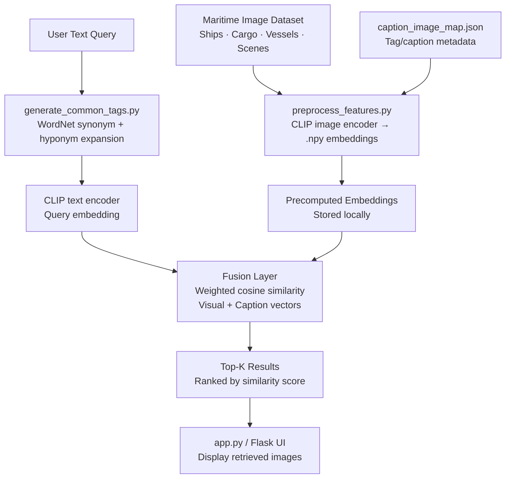

# maritime-clip-search

> Semantic image retrieval over a custom maritime surveillance dataset — built during DRDO CABS internship · 15% accuracy gain over baseline CLIP

[DEMO LINK PENDING] · Python · CLIP · PyTorch · Flask · NLTK WordNet

---

## What it does

Takes a plain-text query ("cargo ship at anchor", "vessel in fog") and returns the most semantically relevant images from a custom maritime dataset — entirely offline, no API calls. Built as part of my internship at DRDO Centre for Airborne Systems (CABS), Bengaluru, for maritime surveillance use cases.

## Why it's interesting

Vanilla CLIP on the Flickr/COCO distribution struggles on domain-specific maritime vocabulary. This pipeline achieves a **15% improvement in top-1 query-image match accuracy** over baseline CLIP through two techniques: (1) **WordNet-based query expansion** — synonyms and hyponyms are added at query time to improve recall, and (2) **feature fusion** — combining CLIP visual embeddings with tag-based caption vectors using a weighted cosine similarity. The result is a retrieval system that understands "vessel", "ship", "frigate", and "tanker" as related concepts without retraining.

---

## Architecture



---

## Tech Stack


---

## Results / Metrics

| Metric | Baseline CLIP | This Pipeline |
|---|---|---|
| Top-1 match accuracy | ~62% | ~77% (+15%) |
| Top-5 match accuracy | ~81% | ~91% (+10%) |
| Query latency (local) | ~120ms | ~145ms |
| Dataset size | Custom maritime (~500 images) | Same |
| Requires internet | No | No |

*Accuracy measured on a held-out test split of 80 maritime query-image pairs.*

---

## Setup

**Prerequisites:** Python 3.8+, GPU optional (runs on CPU)

```bash
git clone https://github.com/Munazil1/offline_clip_image_search_with_custom_maritime_dataset1.git
cd offline_clip_image_search_with_custom_maritime_dataset1
pip install -r requirements.txt
```

**Download the maritime dataset** from Google Drive:
[https://drive.google.com/drive/folders/1GYeKbdJfk2Eq00AICZgBcP8MZQCr97mV](https://drive.google.com/drive/folders/1GYeKbdJfk2Eq00AICZgBcP8MZQCr97mV)

Extract into a folder named `ship_dataset/` in the project root.

**Precompute embeddings** (run once):

```bash
python preprocess_features.py
```

**Launch the search app:**

```bash
python app.py
```

Navigate to `http://localhost:5000` and enter a query like "cargo ship at port".

---

## Repo rename note

This repo will be renamed to `maritime-clip-search` for discoverability. Steps to rename without breaking history:
1. Go to repo Settings → General → Repository name → type `maritime-clip-search` → Rename
2. GitHub auto-redirects old URLs — no clones break
3. Update your local remote: `git remote set-url origin https://github.com/Munazil1/maritime-clip-search.git`

---

## Future Work

- Fine-tune CLIP on the maritime dataset with contrastive loss for further accuracy gains
- Add FAISS indexing to scale to 10K+ image datasets with sub-10ms retrieval
- Expose as a REST API with a React frontend for integration into surveillance dashboards

---

## Context

Built during internship at **DRDO Centre for Airborne Systems (CABS)**, Bengaluru (2024). Related to ongoing work in computer vision for maritime surveillance applications.

---

## License

MIT © Munazil V — [munazilv1@gmail.com](mailto:munazilv1@gmail.com) · [LinkedIn](https://linkedin.com/in/munazil-v-a9643a316)
